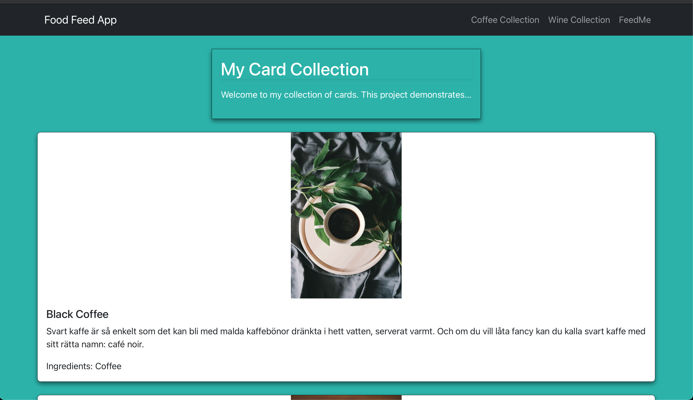

# Food Feed App
_Note - This is a just dev sandbox project used for learning new technologies. 
        Not intended to for public use._

This is a project to fetch data from an external api and render it in components using ReactJS and TypeScript. 

In order to run this app, run the following command from the root directory:

### `npm start`

This runs the app in the development mode.\
Open [http://localhost:3000](http://localhost:3000) to view it in your browser.

The page will reload when you make changes.\
You may also see any lint errors in the console.

## Demo Screenshot:
_Here's a snippet of the app in action_ 

### _TODO:_
1. Refactor CardList component - pull out single Card component
2. Add pagination to lists (wine list really long)
3. Add a homepage. Currently blank
4. Fix some animations and CSS (CardList Title is ugly)
5. ...
